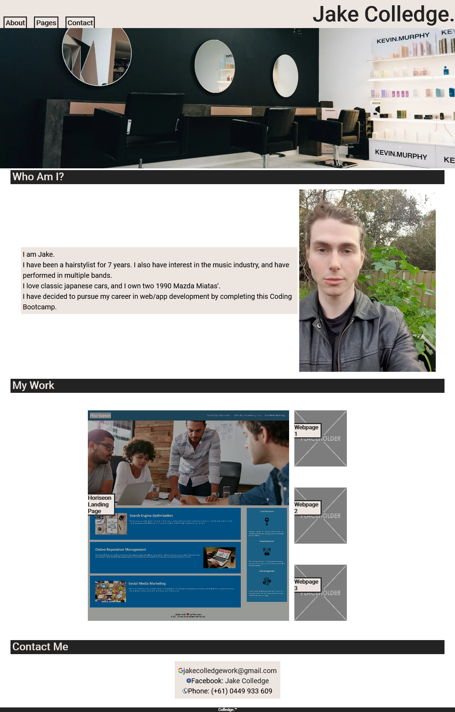

# Homework Assignment - Week 2

## Portfolio page 

- [Description](#Description)
- [Installation](#To-edit-this-projects-repository)
- [Assets](#Assets)
- [Licensing](#License)

## Description

This page is a portfolio for myself. I will be adding to this page through-out the bootcamp as I learn new concepts, but for now this page consists of basic HTML & css to showcase my understanding of the fundamentals. 

The page consists of
- A head containing navigation links to the rest of the page.
- An about me section with some information about myself.
- A section containing my work (for the moment only consists of my week 1 homework)
- A section containing information on where to contact me.
- A footer to mark the end of the page

This has helped me in understanding the 'flex' property in order to align different elements in HTML. This has also help my understanding of psuedo-classes in CSS.

## To edit this projects repository

1. Open an empty project in VS code.
2. Open an integrated terminal and copy and paste the following to clone the repo:
```
git clone git@github.com:jakecolledge97/jake-colledge-portfolio.git
```
(this is found on my github page in the horiseon landing page repository https://github.com/jakecolledge97/jake-colledge-portfolio .)

3. right click in the open index.html document and select open in default browser.
## Assets

The following image contains a screenshot of the full webpage live at: https://jakecolledge97.github.io/jake-colledge-portfolio/




## License 

Copyright (c) 2021 Jake Colledge

Permission is hereby granted, free of charge, to any person obtaining a copy
of this software and associated documentation files (the "Software"), to deal
in the Software without restriction, including without limitation the rights
to use, copy, modify, merge, publish, distribute, sublicense, and/or sell
copies of the Software, and to permit persons to whom the Software is
furnished to do so, subject to the following conditions:

The above copyright notice and this permission notice shall be included in all
copies or substantial portions of the Software.

THE SOFTWARE IS PROVIDED "AS IS", WITHOUT WARRANTY OF ANY KIND, EXPRESS OR
IMPLIED, INCLUDING BUT NOT LIMITED TO THE WARRANTIES OF MERCHANTABILITY,
FITNESS FOR A PARTICULAR PURPOSE AND NONINFRINGEMENT. IN NO EVENT SHALL THE
AUTHORS OR COPYRIGHT HOLDERS BE LIABLE FOR ANY CLAIM, DAMAGES OR OTHER
LIABILITY, WHETHER IN AN ACTION OF CONTRACT, TORT OR OTHERWISE, ARISING FROM,
OUT OF OR IN CONNECTION WITH THE SOFTWARE OR THE USE OR OTHER DEALINGS IN THE
SOFTWARE.